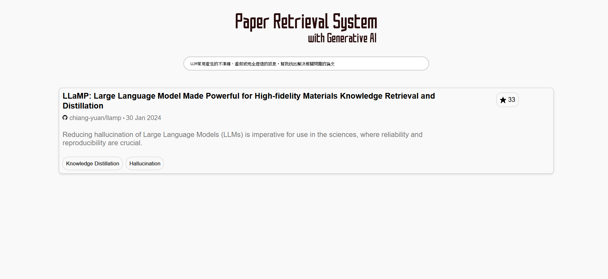

# Final Project - Paper Retrieval System

## What is a Paper Retrieval System

- A system that enhances article retrieval capabilities by integrating LLM
- Goal：To allow users to retrieve papers through natural language.



## Data Source(Crawling)


- [Paper with code](https://paperswithcode.com/)
- Papers with Code is the platform that contains research papers with code implementations
- Users can conveniently find and track the latest machine learning papers and related code.
- Crawling url, title, github-author, github-link, date, abstract, star, tasks.


## System Architecture


### Rule

> [rule]
**Let’s think step by step**
1.You must generate task keywords based on the context.
2.Find tasks similar to [tasks] based on the keywords.
3.Output the similar tasks.
[/rule]
[Notice]
1.The output format must be {‘tasks’: ‘tasks1’} or {‘tasks’: [‘tasks1’, ‘tasks2’]}.
2.The output tasks must appear in [tasks].
~~3.If no similar tasks are found, output{'tasks': ['Other']}.~~
[/Notice]
> 

### Code

**import**

```python
import pathlib
import textwrap

import google.generativeai as genai

from IPython.display import display
from IPython.display import Markdown

import pandas as pd
import ast

from flask import Flask, request, render_template
```

**set gemini model**

```python
def to_markdown(text):
  text = text.replace('•', '  *')
  markdown_text = textwrap.indent(text, '> ', predicate=lambda _: True)
  return Markdown(markdown_text)

genai.configure(api_key='Your api key')

model = genai.GenerativeModel('gemini-pro')
```

**set prompt**

```python
#設定rule
rule="[tasks]Multiple Object Tracking,Domain Generalization,Code Generation,Arithmetic Reasoning,Audio Generation,Multi-Task Learning,Automatic Speech Recognition (ASR),Language Modelling,Large Language Model,Image Inpainting,Face Swapping,Image Restoration,Motion Planning,Imitation Learning,Knowledge Graphs,Hippocampus,Real-Time Object Detection,Open Vocabulary Object Detection,Question Answering,Video Generation,Image Generation,graph construction,4k,Text-to-Image Generation,Image Captioning,Adversarial Robustness,Image Animation,Object,Data Augmentation,Denoising,3D Reconstruction,Synthetic Data Generation,Style Transfer,Position,Pose Estimation,Human Mesh Recovery,3D Human Pose Estimation,Decoder,Text-to-Video Generation,Quantization,Graph Question Answering,Common Sense Reasoning,3D Scene Reconstruction,Code Completion,Class-level Code Generation,Time Series,Scheduling,Contrastive Learning,Collaborative Filtering,Data Integration,Automatic Speech Recognition,Depth Estimation,3D Generation,Autonomous Driving,Decision Making,AI Agent,Retrieval,Information Retrieval,Chatbot,reinforcement-learning,Virtual Try-on,Text-To-SQL,Data Interaction,Navigate,Attribute,Sentiment Analysis,Self-Supervised Learning,Knowledge Distillation,Hallucination,Domain Adaptation,object-detection,Image Classification,Computational Efficiency,Logical Reasoning,Image Harmonization,Recommendation Systems,Click-Through Rate Prediction,Image Compression,Reinforcement Learning (RL),Novel View Synthesis,GSM8K,Text Generation,Node Classification,Text to 3D,Community Detection,Natural Language Understanding,Few-Shot Learning,Super-Resolution,Instruction Following,Visual Question Answering,Video Understanding,Surface Reconstruction,Image to Video Generation,Multiple-choice,Math,Lesion Detection,Anomaly Detection,Automated Theorem Proving,Camera Calibration,Time Series Forecasting,Acoustic Scene Classification,Speech Recognition,speech-recognition,3D Instance Segmentation,Representation Learning,Audio Classification,Marketing,Translation,Visual Reasoning,Change Detection[/tasks]\
[rule]Let’s think step by step 1.You must generate task keywords based on the context.2.Find tasks similar to [tasks] based on the keywords.3.Output the similar tasks.[/rule] \
[Notice]1.The output format must be {‘tasks’: ‘tasks1’} or {‘tasks’: [‘tasks1’, ‘tasks2’]}.2.The output tasks must appear in [tasks].3.If no similar tasks are found, output {'tasks': ['Other']}.[/Notice]\
[example]{'tasks': ['Code Generation', 'Program Synthesis']}[example]"

app = Flask(__name__)

@app.route('/', methods=['GET', 'POST'])
def search():
    data = {}
    if request.method == 'POST':

        query = request.form['query']
				#取得使用者輸入的問題
        prompt = "[context]" + query + "[/context]"
```

**LLM generate**

```python
        #將rule跟使用者的輸入與規則合併 詢問Gemini
        response = model.generate_content(prompt+rule)
        markdown_obj = to_markdown(response.text).data
        print(response.text)
```

**Retrieval Doc**

```python
        df = pd.read_csv('paperswithcode.csv')

        tasks_ = ast.literal_eval(response.text)

        labels = tasks_['tasks']

        # 查詢tasks欄位中符合標籤的
        matched_rows = df[df['tasks'].apply(lambda x: any(label in x.split(',') for label in labels))]

        #防止太長 被...取代
        pd.set_option('display.max_colwidth', None)
				#打包
        data = {
            'url': (matched_rows['url'].to_string(index=False)).split('\n'),
            'title': (matched_rows['title'].to_string(index=False)).split('\n'),
            'github_author': (matched_rows['github-author'].to_string(index=False)).split('\n'),
            'github_link': (matched_rows['github-link'].to_string(index=False)).split('\n'),
            'date': (matched_rows['date'].to_string(index=False)).split('\n'),
            'abstract': (matched_rows['abstract'].to_string(index=False)).split('\n'),
            'star': (matched_rows['star'].to_string(index=False)).split('\n'),
            'tasks': (matched_rows['tasks'].to_string(index=False)).split('\n'),
        }
```

## Result


